#Jarkom-Modul-1-2026-k-34

## Member

|No|Nama|NRP|
|---|---|---|
|1|Muhammad Syadzili Abdul Muhyi|5027251030|
|2|Bambang Nasarillah Kurniawan|5027251110|

---

## Laporan

#### 1. Untuk mempersiapkan pembangunan The Wired, Lain yang berperan sebagai Router membuat tiga Switch/Gateway: Switch 1 menuju dua Entitas yaitu Alice dan Mika, Switch 2 menuju Chisa, sedangkan Switch 3 menuju Knights dan Eiri. Kelima Entitas tersebut dikonfigurasi sebagai Client di GNS3. **[GUNAKAN PREFIX IP MASING-MASING KELOMPOK]**

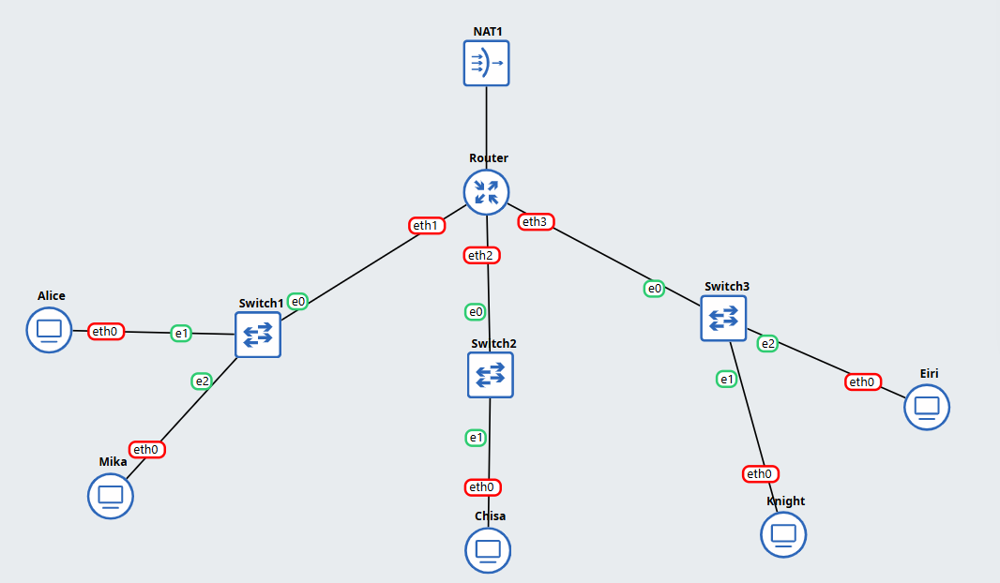

Disini dibuatlah topologi jaringan sesuai dengan yang diminta oleh soal, yaitu dengan menggunakan beberapa konfigurasi berikut:

- **NAT1** : untuk bisa mendapatkan dynamic IP melalui DHCP dan bisa terkoneksi ke internet.
- **Router Eru** : sebagai networking awal yang terkoneksi dengan NAT, menggunakan Docker image _ervn-debi_.
- **Switch 1, 2, dan 3** : sebagai gateway/penghubung antara Router Eru dengan setiap client yang terkoneksi.
- **Client (Alice, Mika, Chisa, Knight, Eri)** : sebagai simulasi real client yang terhubung dalam topologi jaringan tersebut.

#### 2. Karena menurut Lain pada saat itu The Wired masih terisolasi dari dunia luar, konfigurasikan router Lain agar dapat tersambung langsung ke jaringan internet publik melalui NAT/DHCP pada interface eth0.

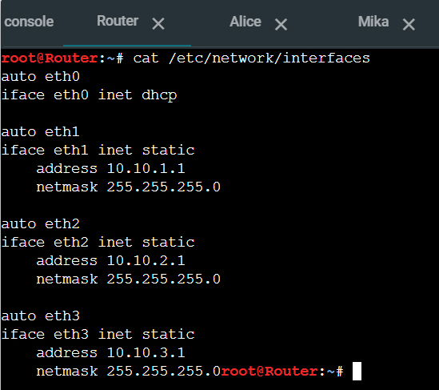

Dapat kita lihat bahwa router berhasil di konfigurasi dengan 3 eth untuk 3 switch gateway tempat user/client berada

#### 3. Karena menurut Lain pada saat itu The Wired masih terisolasi dari dunia luar, konfigurasikan router Lain agar dapat tersambung langsung ke jaringan internet publik melalui NAT/DHCP pada interface eth0.

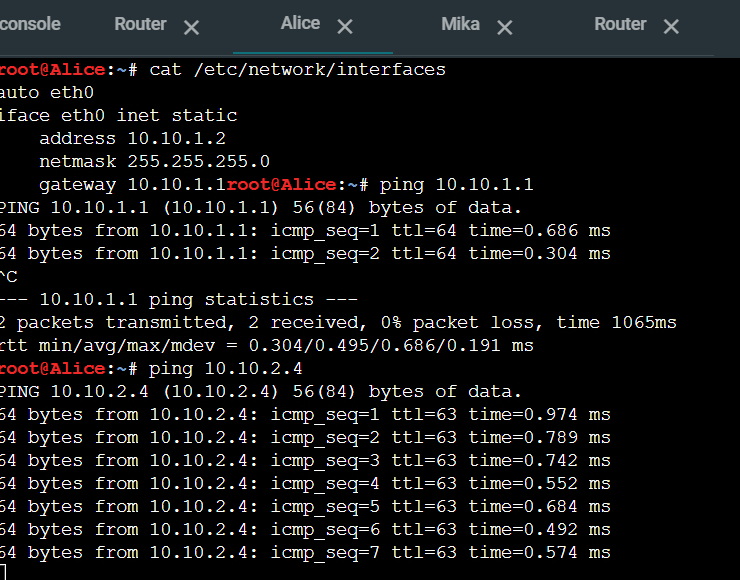

Setelah melakukan configurasi kita akan melakukan pengetesan jaringan menggunakan `ping`

1. Tes ping mika ke knight

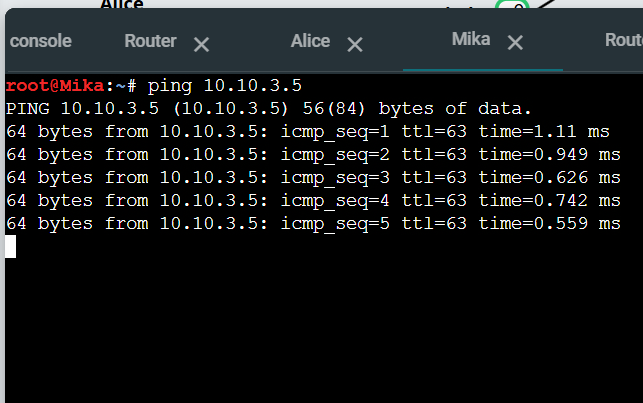

b. Tes ping Chisa ke Airi

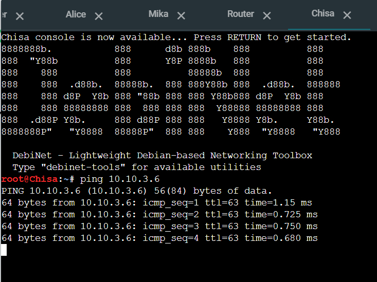

Dengan 2 bukti SS diatas kami rsaa cukup untuk membuktikan bahwa koneksi konfigurasi berhasil dilakukan

#### 4. Lain ingin agar setiap Entitas (Client) memiliki kemandirian di The Wired. Konfigurasikan firewall/iptables (NAT Masquerade) dan DNS resolver agar setiap Client dapat terhubung ke internet secara mandiri (dapat melakukan ping ke 8.8.8.8 dan membuka domain web [google.com](http://google.com/)).

Sebeluk tersambung ke internet kamu membuat script terlebih dahulu yang kami namakan [`script.sh`](http://script.sh) agar mereka mempunyai nameserver masing2 pada setiap client kemudian menjalankan script di router agar mereka dapat terhubung ke internet.

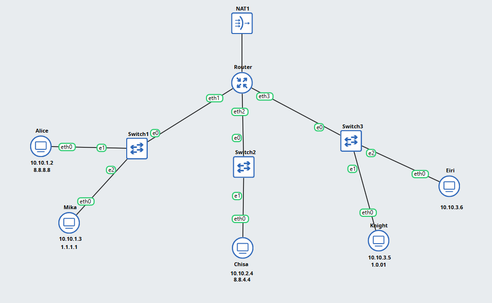

berikut adalah bukti bahwa semua client dapat tersambung ke internet

1. Alice

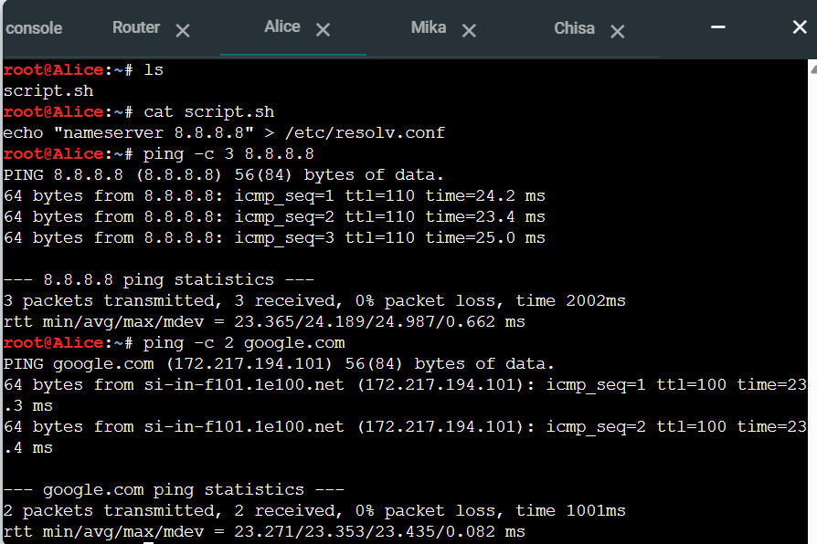

b. Mika

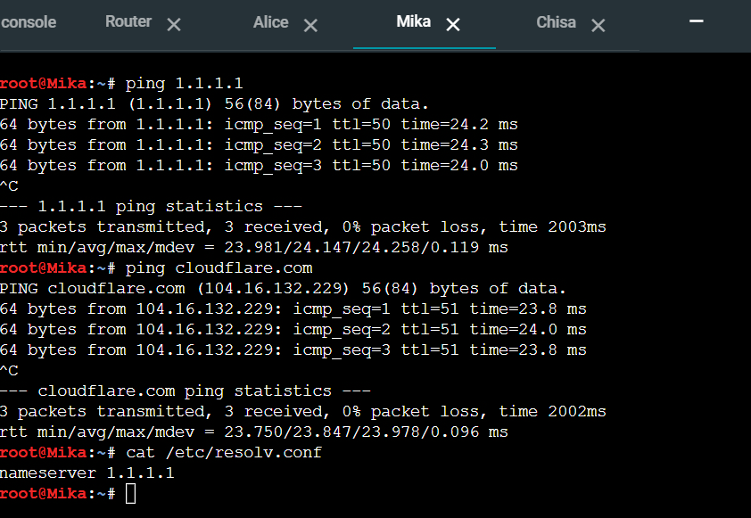

c. Chisa

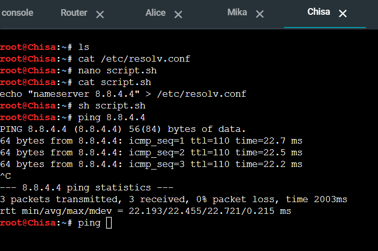

d. Knight

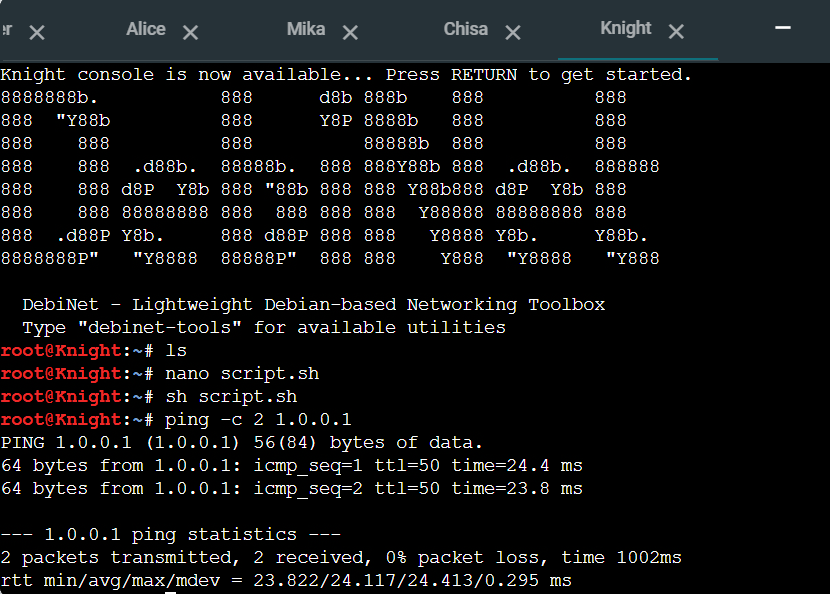

e. Eiri

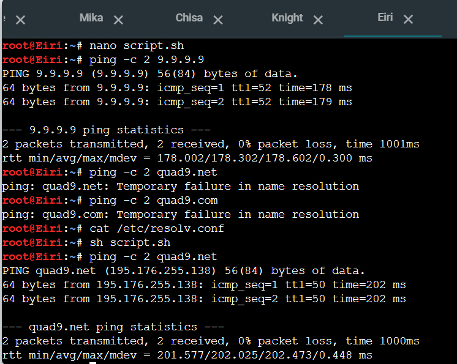

#### 5. Eiri tetap berupaya menanamkan kekacauan ke dalam jaringan. Untuk mengantisipasi restart tiba-tiba, pastikan seluruh konfigurasi jaringan tidak hilang saat semua node di-restart. Buat script verifikasi di /root/cek_status.sh pada router Lain yang menampilkan ringkasan interface (ip -br a) dan status tabel NAT (iptables -t nat -L -v -n) setelah reboot.

Di sini kami menamai script kami seabgai `cek_status` yang berisi command sesuai diperintah.

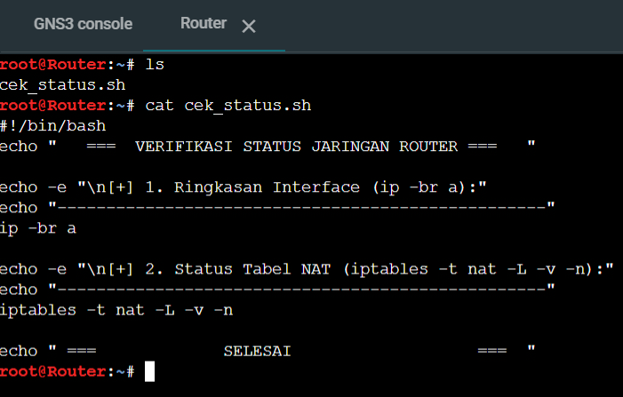

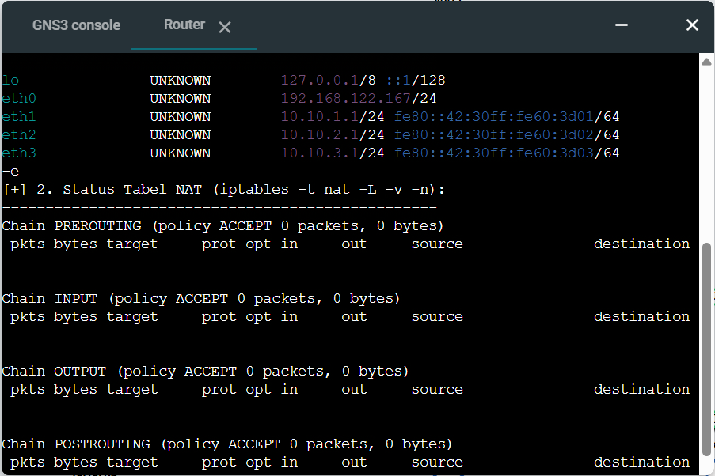

#### 6. Mika mencurigai adanya anomali traffic pada segmen jaringannya. Jalankan generator traffic berikut ([link file](https://drive.google.com/drive/folders/1ZjFvWIjvAQAjE9pPthm7V_bGyaSt93lY?usp=sharing)) pada node Mika, lalu lakukan packet sniffing menggunakan Wireshark pada interface node Mika. Terapkan display filter khusus untuk menyaring paket yang berprotokol

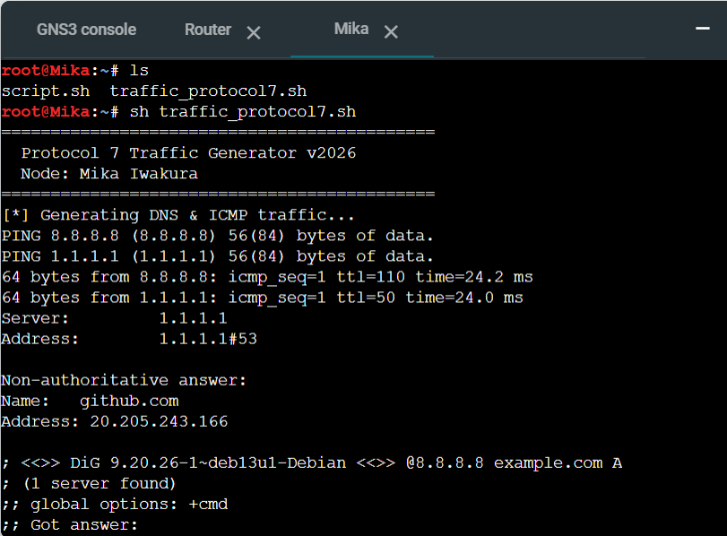

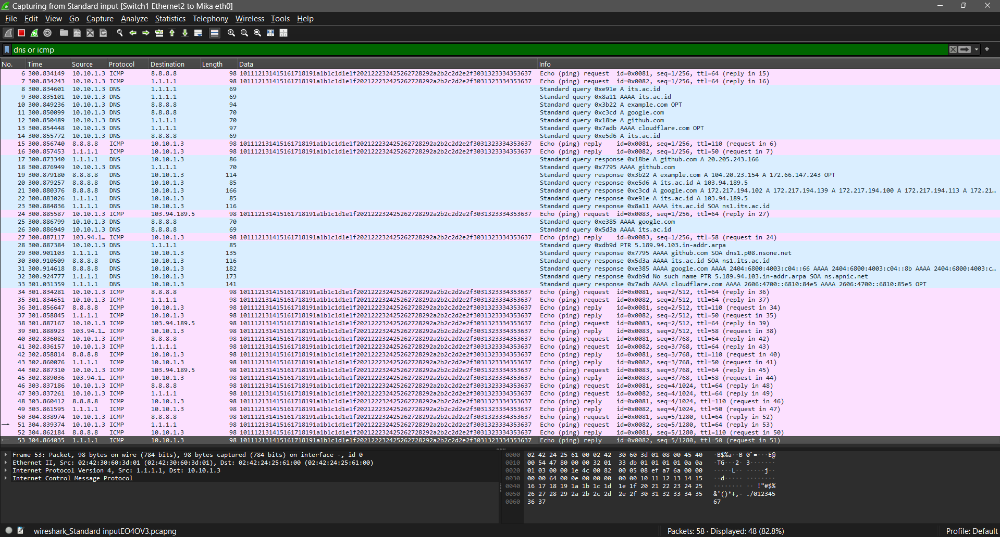

#### 7. Chisa memutuskan mendirikan FTP Server pada node miliknya dengan shared folder di /var/wired/data. Terapkan kebijakan akses: user alice (hak akses read & write), user mika (dibatasi read-only), dan user eiri (dibatasi tanpa izin akses / blacklist). Buktikan konfigurasi dengan membuat file signal_alice.txt dari user alice, dan buktikan penolakan akses saat user eiri mencoba login.

Langkah pertama yang kita lakukan adalah membuat shared folder sesuai dengan soal

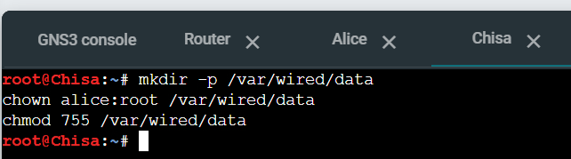

setelah membuat shared folder kita akan mengeset hak akses agar Alice menjadi pemilik yang bisa melakukan read dan write

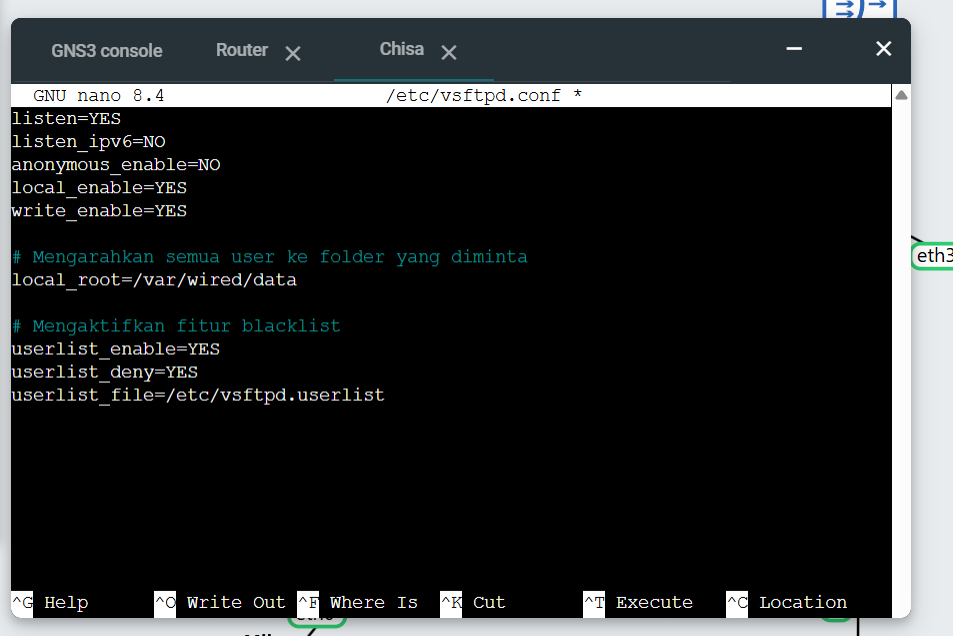

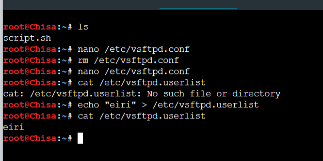

Kemudian kita restard service vsftpdnya

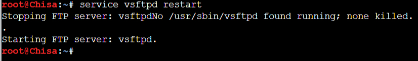

buat file txt di alice dan unduh ftp (apt install ftp -y )

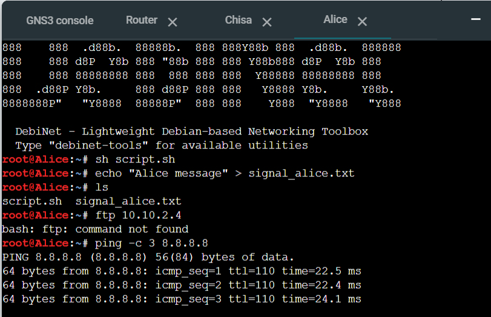

sebelum connect, buat akun dlu di terminal chisa

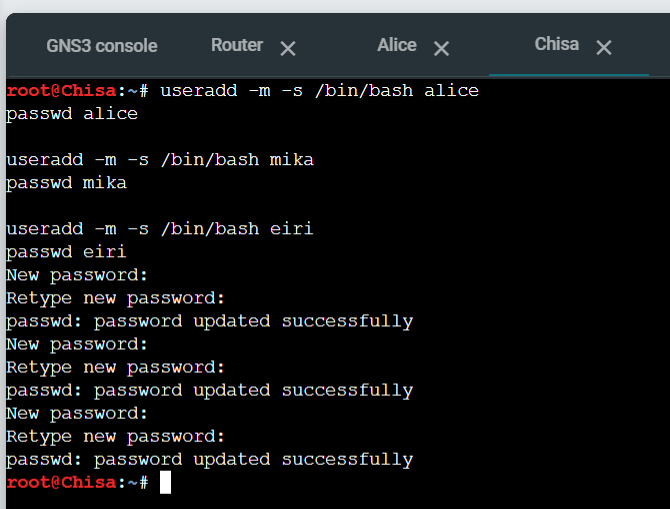

dengan password “sss” kemudian kita tes

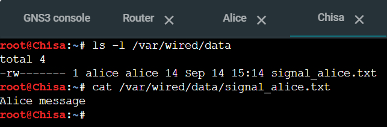

dapat kita lihat bahwa apa yang kita lakukan berhasil

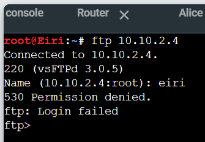

Sekarang kita uji user eiri dan dapat kita lihat eiri diblacklist

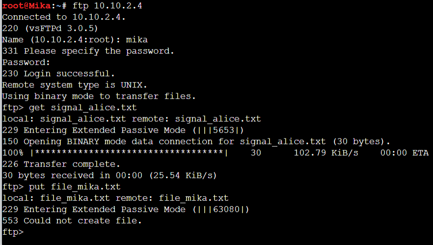

mika berhasil ngunduh file dan Saat Mika mencoba mengunggah file miliknya (put file_mika.txt), server memblokirnya dan mengeluarkan pesan error yang 553 itu (read only nih bos)

#### 8. Kelompok rahasia Knights perlu mengirimkan dokumen laporan intelijen ke FTP Server Chisa. Lakukan koneksi FTP client dari node Knights ke FTP Server Chisa menggunakan akun alice. Upload file berikut ([link file](https://drive.google.com/drive/folders/1tvZpueSH9E3GWwXM6KNnM64Y5wNoIAYP?usp=sharing)). Analisis sesi Wireshark dan sebutkan: perintah FTP untuk upload (STOR), kode status sukses server (226), dan port data TCP yang dinegosiasikan pada mode PASV.

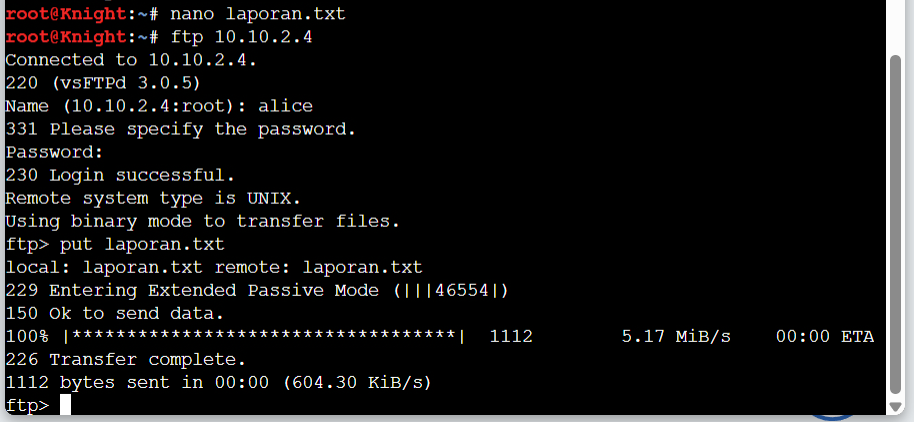

dari terminal knight login akun alice dan ngirim laporan.txt ke chisa

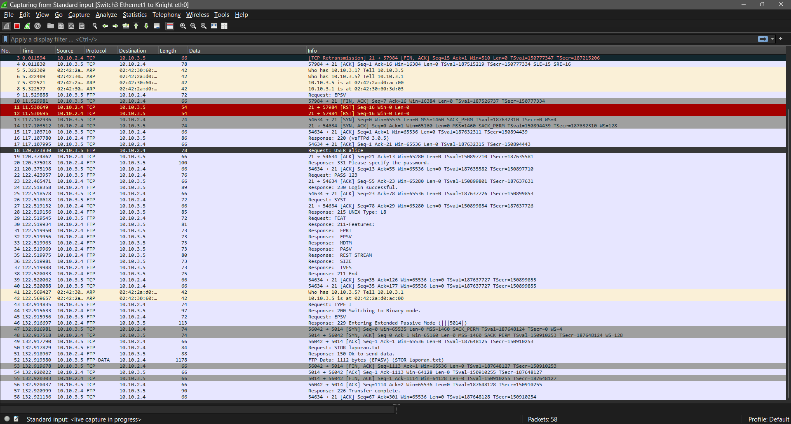

Paket No. 45 & 46: Alih-alih mode PASV standar, klien FTP Anda secara otomatis menegosiasikan (EPSV) yang lebih modern. Server Chisa merespons dengan 229 Entering Extended Passive Mode

Port data TCP yang dibuka oleh server untuk jalur transfer file ini adalah Port 5014._(Anda bisa melihat pada paket No. 47-49, PC Knight (port 56042) melakukan TCP handshake ke Chisa di port 5014 tersebut untuk memulai koneksi data)._

Paket No. 50: Setelah jalur data di port 5014 terbuka, klien Knight mengirimkan perintah kontrol Request: STOR laporan.txt melalui port 21. Perintah STOR inilah yang menginstruksikan FTP server untuk menerima dan menyimpan file bernama laporan.txt

Paket No. 57: Setelah seluruh isi file selesai dikirim melalui port 5014, FTP Server Chisa mengirimkan pesan penutup melalui jalur kontrol (port 21) dengan kode Response: 226 Transfer complete.. Ini mengonfirmasi bahwa file laporan.txt telah berhasil diterima secara utuh dan disimpan di server.

Berikut FPT-DATA Nya

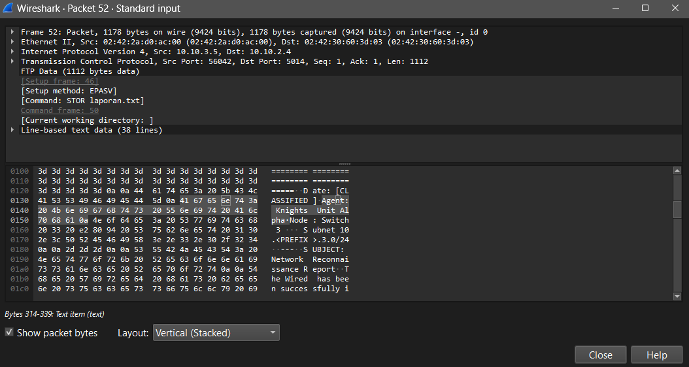

#### 9. Mika mengakses dokumen Protokol Tujuh di ([link file](https://drive.google.com/drive/folders/1S3hG0dnZBTkCta4uILWwKVc6dSYYGRJ6?usp=sharing)) dari FTP Server Chisa. Dari node Mika, unduh file tersebut menggunakan akun mika. Setelah itu, buktikan pembatasan read-only dengayahn mencoba mengunggah file baru dari akun mika, dan tunjukkan pesan error respon server (error 550 Permission denied) saat mika mencoba melakukan upload.

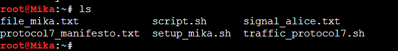

Setelah kita mendownload file dari google drive langkah pertama yang kita lakukan adalah melakukan upload file ke FTP melalui client Chisa dengan cara memindahkan file tersebut ke /var/wired/data/ menggunakan command cp kemudian kita ke client Mika untuk mengakses mengakses dan mendownload file tersebut

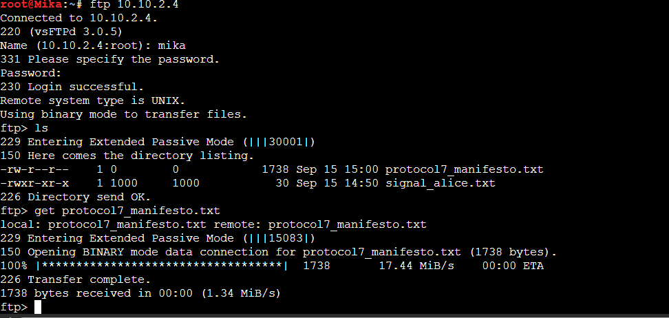

Dapat dilihat pada gambar Mika berhasil mendownload file protocol7_manifesto.txt milik chisa melalui FTP server, tetapi saat membuat file karena Mika tidak punya permision

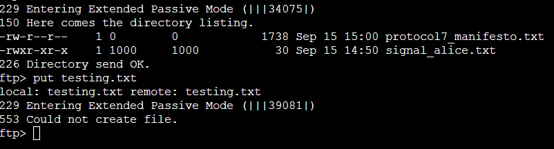

#### 10. Knights melancarkan uji ketahanan koneksi ke server Chisa untuk menguji latensi jaringan The Wired. Kirimkan paket ping dari node Knights ke node Chisa dengan payload khusus 128 bytes dan interval 0.3 detik sebanyak 77 paket (ping -c 77 -s 128 -i 0.3 <IP_Chisa>). Buka Wireshark, catat nilai ICMP Type dan Code untuk Echo Request vs Echo Reply, serta analisis packet loss dan RTT (min/avg/max)

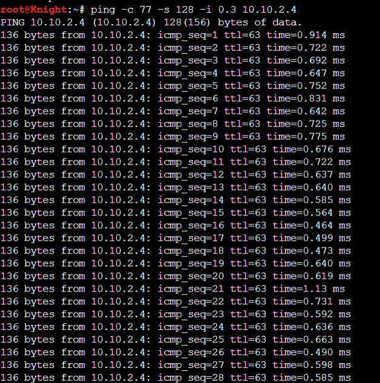

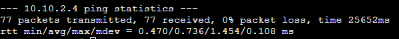

Picture saat melakukan ping ke Chisa dan ssan min/avg/max/mdev adalah 0.470/0.736/1.454/0.100

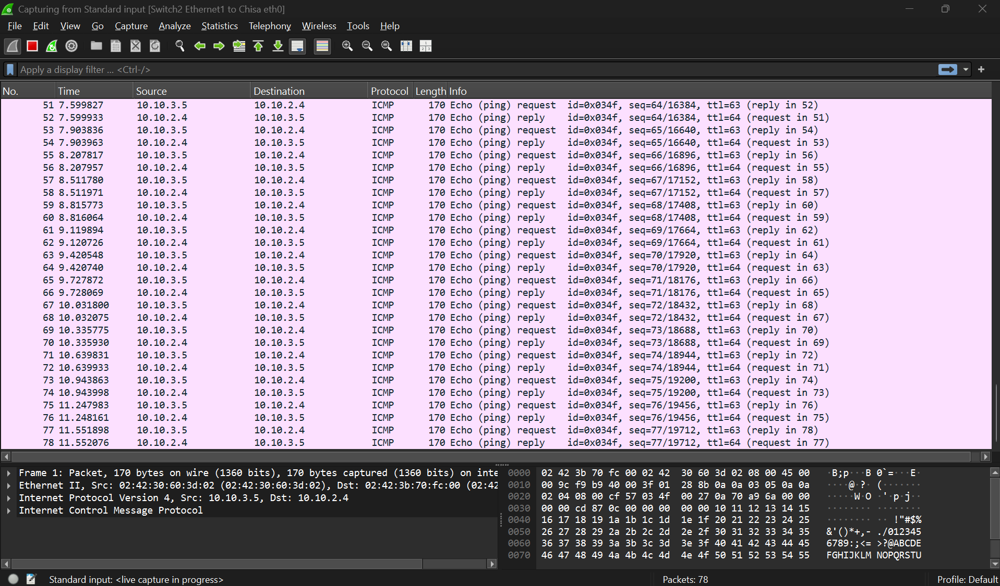

Berdasarkan hasil capture Wireshark, ICMP Echo Request memiliki Type 8 Code 0, sedangkan Echo Reply memiliki Type 0 Code 0. Dari 77 paket yang dikirim, seluruh paket berhasil menerima balasan sehingga packet loss sebesar 0%. Nilai RTT yang diperoleh adalah minimum 0.047 ms, rata-rata 0.150 ms, dan maksimum 0.498 ms, yang menunjukkan koneksi dengan latensi rendah dan stabil.

#### 11. Buktikan kelemahan protokol Telnet dengan membuat akun phantom_user dan password wired_ghost pada layanan telnetd di node Chisa. Lakukan login Telnet dari node Eiri ke node Chisa dan tangkap sesi menggunakan Wireshark. Tunjukkan kredensial plain text melalui fitur Follow TCP Stream, serta jelaskan mengapa setiap karakter terkirim dalam paket TCP terpisah.

Langkah pertama yang harus kita lakukan adalah membuat phantom_user dengan password wired_ghost dengan command :

```bash
adduser phantom_user
```

kemudian kita akan menambahkan passwordnya.

sebelum kita melakukan telnet ke chisa kita harus terlebih dahulu melakukan sniffing capturing melalui wireshark.

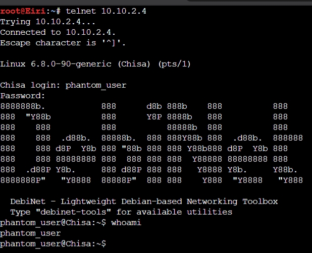

setelah kita masuk kedalam kejaringan telnet chisa maka wireshark automatis melakukan sniffing dan mentrack jaringan atau handshake yang dilakukan oleh telnet

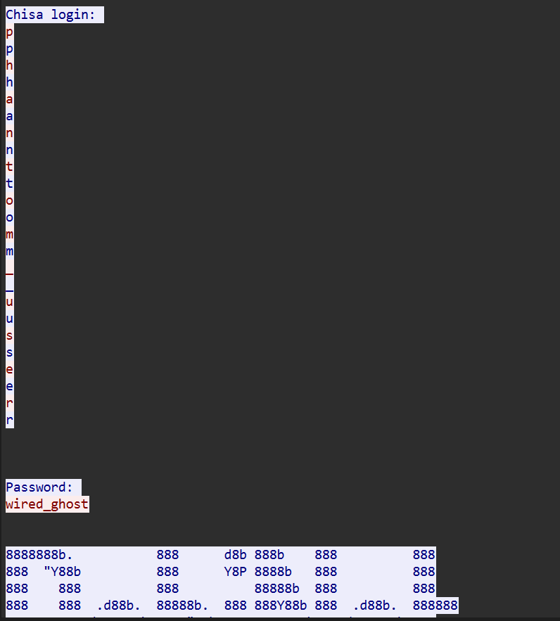

Saat melakukan filtering kedalam wireshark menggunakan command "tcp.stream eq 0" maka muncul sebuah gambar dan jika kita menelusuri hasil filtering tersebut kita akan menemukan sebuah text yang berisi user dan password user, Hal ini terjadi karena Telnet menggunakan mode interaktif NVT (Network Virtual Terminal), di mana setiap satu tombol keyboard yang ditekan langsung dibungkus ke dalam satu paket TCP terpisah tanpa menunggu baris kalimat selesai. Karakter tersebut dikirim ke server, lalu server mengirim balik (echo) karakter yang sama ke layar klien secara real-time, sehingga di Wireshark setiap karakter terekam dalam paketnya masing-masing.

#### 12. Alice mencurigai Knights menjalankan beberapa layanan rahasia di node-nya. Lakukan pemindaian port dari node Alice ke node Knights menggunakan Netcat (nc) untuk memeriksa port 22 (SSH) dan 80 (HTTP) dalam keadaan terbuka, serta port rahasia 7777 dalam keadaan tertutup. Analisis di Wireshark perbedaan TCP Flag yang dikembalikan antara port terbuka (SYN-ACK) dengan port tertutup (RST-ACK).

Setelah kita melakukan configure SSH pada knight maka kita akan menjalankan command

```bash
nc <ip target> <port>
```

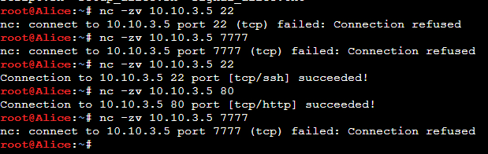

Dapat kita lihat bahwa port 22 dan 80 berhasil untuk connect sedangkan 7777 tidak berhasil karena kita bersifat tertutup.

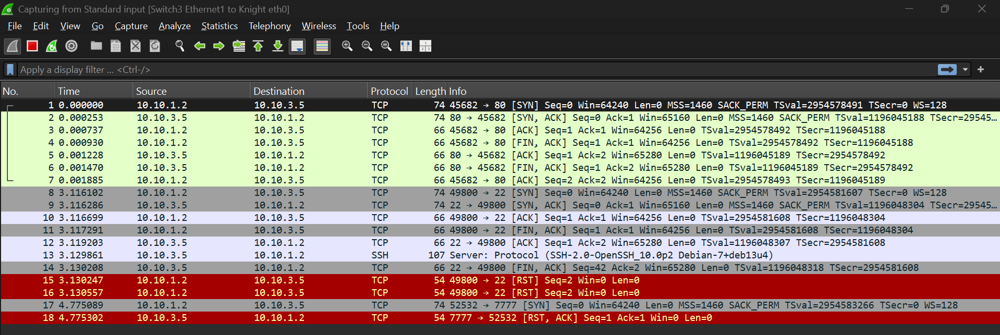

Saat memantau Wireshark, terlihat perbedaan respons sebagai berikut.

Paket SYN-ACK (port terbuka):

No. 2 (Port 80/HTTP): 80 -> 45682 [SYN, ACK]

No. 9 (Port 22/SSH): 22 -> 49800 [SYN, ACK]

Paket RST-ACK (port tertutup):

No. 18 (Port 7777): 7777 -> 52532 [RST, ACK]

Paket nomor 2 dan 9 berasal dari node Knight (10.10.3.5) ke Alice (10.10.1.2), yang menandakan layanan HTTP dan SSH aktif serta siap melanjutkan three-way handshake. Sebaliknya, pemindaian ke port 7777 pada paket nomor 17 (flag [SYN]) dibalas oleh node Knight pada paket nomor 18 dengan flag [RST, ACK]. Hal ini membuktikan bahwa tidak ada layanan yang sedang listening pada port tersebut, sehingga sistem otomatis menolak dan memutus percobaan koneksi.

#### 13. Lain memerintahkan agar administrasi jarak jauh menggunakan SSH secara aman tanpa password. Install OpenSSH server pada node Knights, buat pasangan kunci SSH (ssh-keygen) pada node Mika untuk user mika_admin, dan konfigurasikan public key authentication (PasswordAuthentication no). Lakukan koneksi SSH dari node Mika ke node Knights, tangkap sesi menggunakan Wireshark, identifikasi paket Protocol Version Exchange dan Key Exchange, serta jelaskan mengapa kredensial tidak terlihat dalam bentuk teks terbuka seperti pada Telnet.

Pada Client Knight kita harus terlebih dahulu membuat user mika_admin dengan cara

```bash
useradd -m -s /bin/bash mika_admin
```

kemudian kita berpindah ke client Mika lalu kita harus membuat ssh-key pada client miak dengan cara:

```bash
ssh-keygen -t ed25519
```

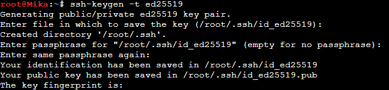

setelah kita membuat ssh-key kita harus melakukan copy ssh-id mika ke knight agar dapat dijalankan tapi sebelum itu kita harus membuat folder untuk ssh mika terlebih dahulu dengan cara

```bash
mkdir -p /home/mika_admin/.ssh
nano /home/mika_admin/.ssh/authorized_keys

```

lalu mengatur tingkat atau hiererarki skalabilitasnya

```bash
chmod 700 /home/mika_admin/.ssh
chmod 600 /home/mika_admin/.ssh/authorized_keys
chown -R mika_admin:mika_admin /home/mika_admin/.ssh

```

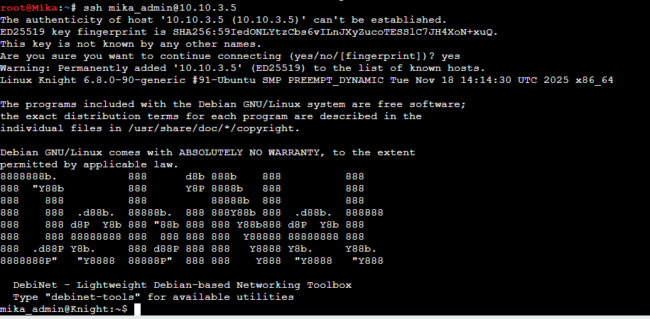

kita sudah berhasil melakukan SSH dari mika ke ip knight saatnya kita melakukan identifikasi paket Protocol Version Exchange dan Key Exchange

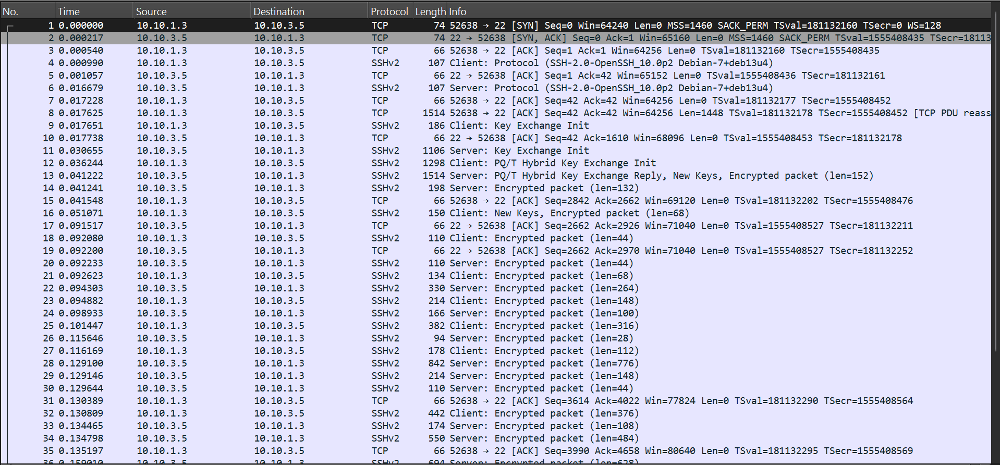

Dapat kita lihat ada banyak sekali log maka kita akan melakukan filtering jadi  protokol SSH dan negosiasi awal masih dapat diidentifikasi melalui Protocol Version Exchange pada paket nomor 4 dan 6 serta proses Key Exchange pada paket nomor 9 hingga 13.

Protocol Version Exchange:

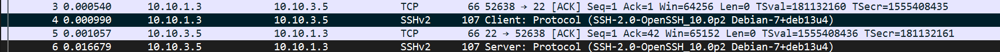

Key Excahnge:

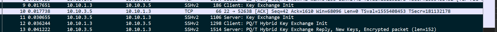

Namun, kredensial autentikasi tidak terlihat dalam bentuk plaintext seperti pada Telnet karena setelah paket nomor 13 (New Keys).

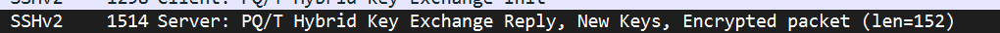

kedua node telah menyepakati kunci enkripsi simetris. Dampaknya, seluruh data sesi setelahnya (paket nomor 14 ke atas) dikirim dalam bentuk acak bertuliskan Encrypted packet, sehingga kredensial autentikasi maupun isi perintah terlindungi secara aman dari penyadapan jaringan.

#### 14. Setelah gagal mengakses FTP, Eiri melancarkan serangan brute-force terhadap form login web Alice. Analisis file capture _wired_bruteforce.pcapng_ untuk mengidentifikasi alamat IP penyerang, target IP beserta port yang diserang, password user lain_admin yang berhasil ditembus, serta web server software dan versi yang dilaporkan pada response header. Validasi temuan kalian pada socket server:([link _file_](https://drive.google.com/drive/folders/1-MloxOyGauBYglc6TKTQ84VeILvJjjG2?usp=sharing)) **nc [IP_Group] 3401**

Langkah pertama yang harus kita lakukan adalah mengidentifikasi terlebih dahulu user yang berhasil login ke port atau ipnya dengan cara melakukan filterisasi di wireshark biasanya kita mengetahui bahwa password dan username itu berhasil adalah dengan keterangan

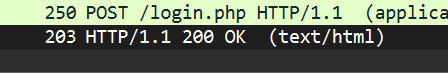

Setelah kita mengetahui nomor paket maka langkah yang kita lakukan adalah meganalisis packet tersebut

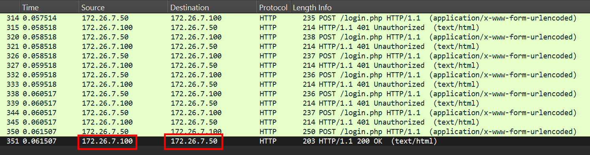

Dapat kita lihat bahwa pada gambar diatas kita dapat langsung melihat ip tujuan dan ip asal, IP yang diserang adalah 172.26.7.100 dengan port 8080 dan ip yang menjadi penyerang adalah 172.26.7.50

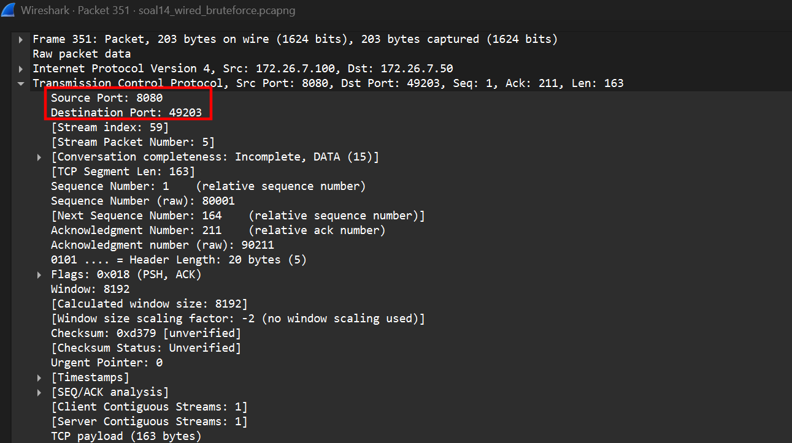

ketika kita scroll kebawah dan membuka section HTTP yang berhasil di encode maka kita akan melihat text yang berisi username dan password yang berhasil masuk setelah di bruteforce

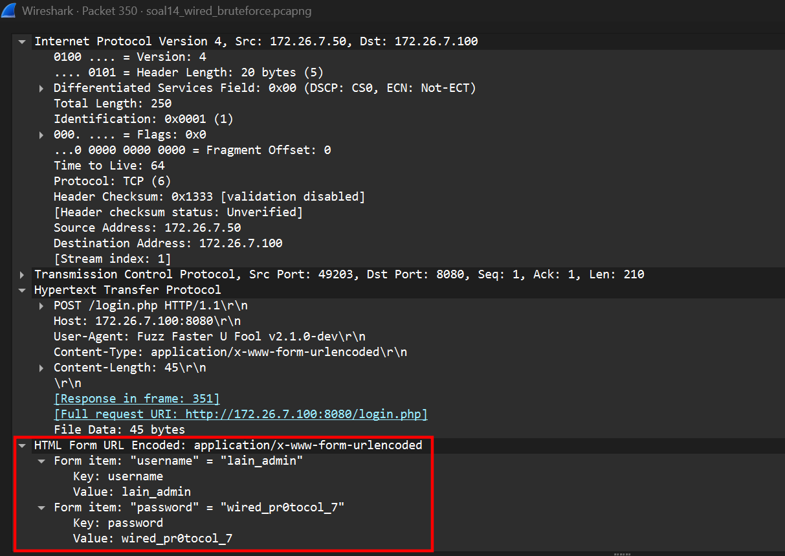

Kemudian selanjutnya ketika kita teliti di bagan sebelah kanan ada version dari web server/software yang digunakan

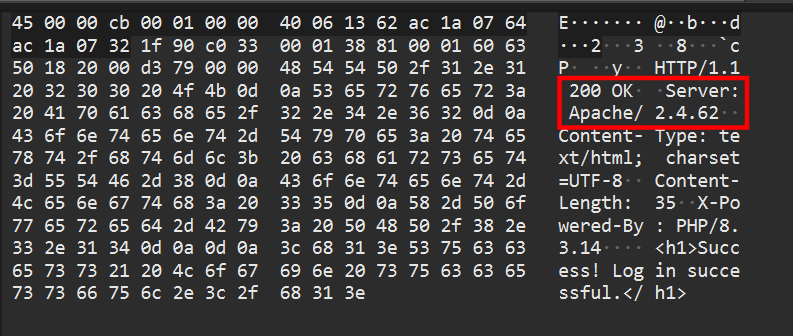

Setelah menjawab semua pertanyaan di file.exe maka kita berhasil mendapatkan flag yang ada

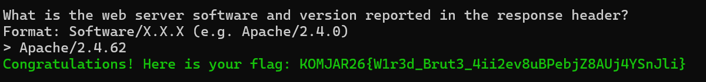

#### 15. Eiri menyusup ke ruang server dan memasang perangkat keyboard USB berbahaya pada node Alice. Buka file capture wired_usb_hid.pcap, identifikasi Vendor ID dan Product ID perangkat USB dari deskriptor USB, alamat nomor device USB, serta pesan rahasia yang berhasil dicuri dari keystroke. Validasi temuan kalian pada socket server: ([link _file_](https://drive.google.com/drive/folders/1oAPzN9IEN0264_LlvGnl_CsIiYh-Hp8w?usp=drive_link)) **nc [IP_Group] 3402**

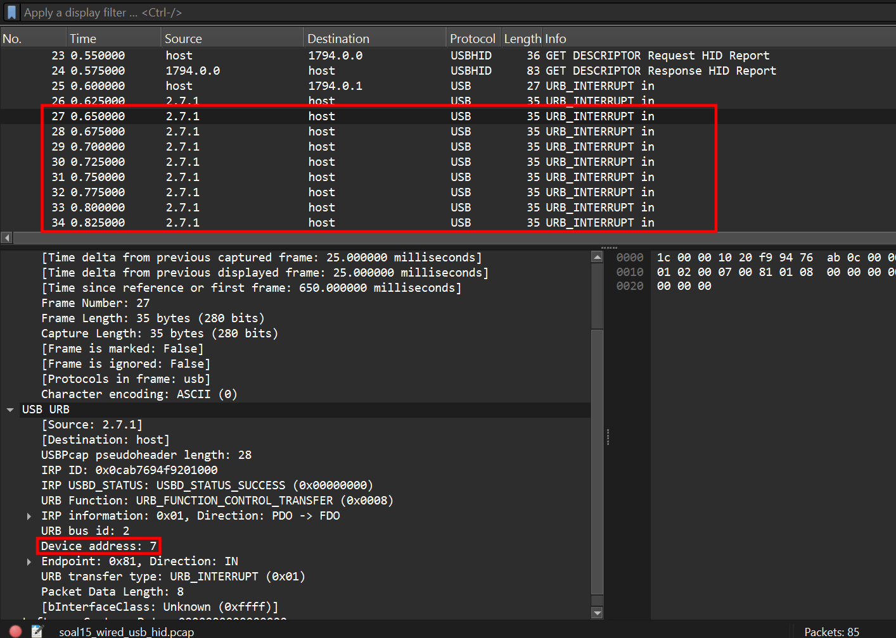

Pada file .pcap diatas dapat kita lihat keterangan paket nomor 1 sampai 6 berkaitan dan itu menjadi pertanda kita untuk melakukan analis kenapa?? karena yang satu respons dan yang satu request jadi GET DESCRIPTOR Request DEVICE adalah paket atau koneksi yang dikirim oleh komputer untuk meminta data identitas perangkat. kemudian GET DESCRIPTOR Response DEVICE adalah adalah balasan dari perangkat USB yang berisi struktur data bernama Device Descriptor makanya dia memiliki idvendor dan idproduk

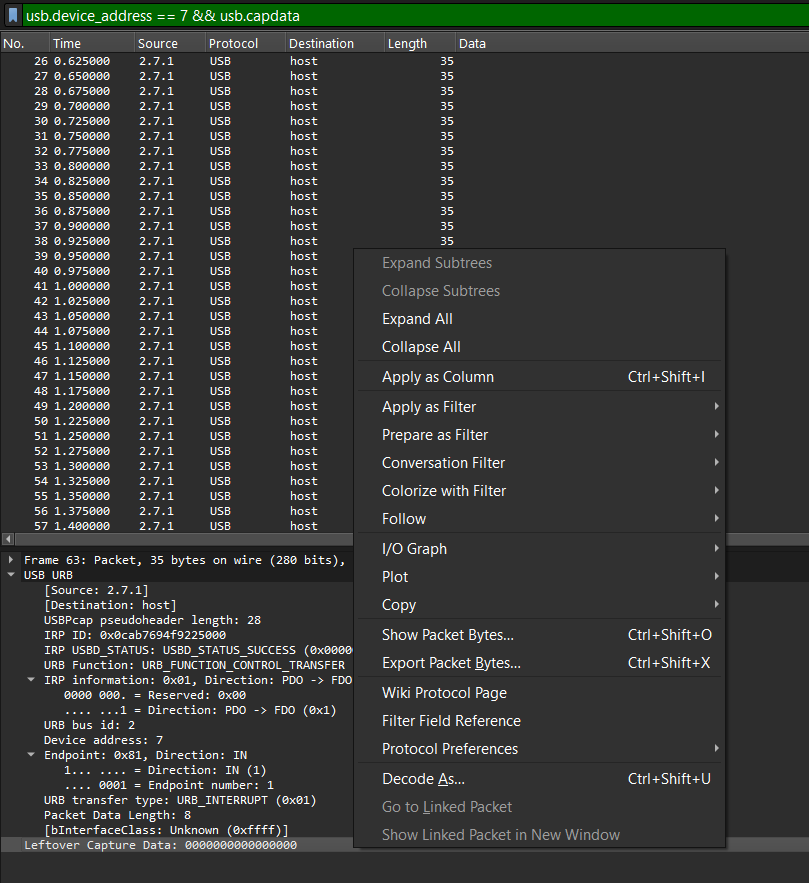

Kemudian kita melakuakn filtering lalu klik salah satu paket, di menu filenya ada leftover capture data, kita jadikan column aja, nanti contohnya seperti dibawah ini

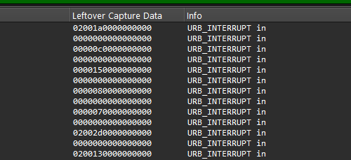

Export jadi csv file, di sini kami expor jadi key.csv lalu kami membuat script untuk decode USB HEX

```bash
import csv
KEYBOARD_MAP = {
    0x04: 'a', 0x05: 'b', 0x06: 'c', 0x07: 'd', 0x08: 'e', 0x09: 'f', 0x0A: 'g', 0x0B: 'h',
    0x0C: 'i', 0x0D: 'j', 0x0E: 'k', 0x0F: 'l', 0x10: 'm', 0x11: 'n', 0x12: 'o', 0x13: 'p',
    0x14: 'q', 0x15: 'r', 0x16: 's', 0x17: 't', 0x18: 'u', 0x19: 'v', 0x1A: 'w', 0x1B: 'x',
    0x1C: 'y', 0x1D: 'z', 0x1E: '1', 0x1F: '2', 0x20: '3', 0x21: '4', 0x22: '5', 0x23: '6',
    0x24: '7', 0x25: '8', 0x26: '9', 0x27: '0', 0x28: '\n', 0x29: 'ESC', 0x2A: 'BACKSPACE',
    0x2B: '\t', 0x2C: ' ', 0x2D: '-', 0x2E: '=', 0x2F: '[', 0x30: ']', 0x31: '\\', 0x33: ';',
    0x34: '\'', 0x35: '`', 0x36: ',', 0x37: '.', 0x38: '/'
}

SHIFT_MAP = {
    'a': 'A', 'b': 'B', 'c': 'C', 'd': 'D', 'e': 'E', 'f': 'F', 'g': 'G', 'h': 'H',
    'i': 'I', 'j': 'J', 'k': 'L', 'm': 'M', 'n': 'N', 'o': 'O', 'p': 'P',
    'q': 'Q', 'r': 'R', 's': 'S', 't': 'T', 'u': 'U', 'v': 'V', 'w': 'W', 'x': 'X',
    'y': 'Y', 'z': 'Z', '1': '!', '2': '@', '3': '#', '4': '$', '5': '%', '6': '^',
    '7': '&', '8': '*', '9': '(', '0': ')', '-': '_', '=': '+', '[': '{', ']': '}',
    '\\': '|', ';': ':', '\'': '"', '`': '~', ',': '<', '.': '>', '/': '?'
}

decoded_message = ""

try:
    with open('key.csv', mode='r') as file:
        csv_reader = csv.DictReader(file)
        
        for row in csv_reader:
            hex_data = row.get('Leftover Capture Data', '').strip()
            if not hex_data or len(hex_data) < 16:
                continue
            
            modifier = int(hex_data[0:2], 16)
            keycode = int(hex_data[4:6], 16)
            
            if keycode != 0:
                char = KEYBOARD_MAP.get(keycode, '')
                if char:
                    if modifier == 0x02 or modifier == 0x20:
                        char = SHIFT_MAP.get(char, char)
                    
                    if char == 'BACKSPACE':
                        decoded_message = decoded_message[:-1]
                    else:
                        decoded_message += char

    print("\n[+] Berhasil memecahkan data USB HID!")
    print(f"[>] Pesan Rahasia: {decoded_message}\n")

except FileNotFoundError:
    print("Error: File 'key.csv' tidak ditemukan. Pastikan namanya benar dan ada di folder yang sama.")
except Exception as e:
    print(f"Terjadi kesalahan: {e}")

```

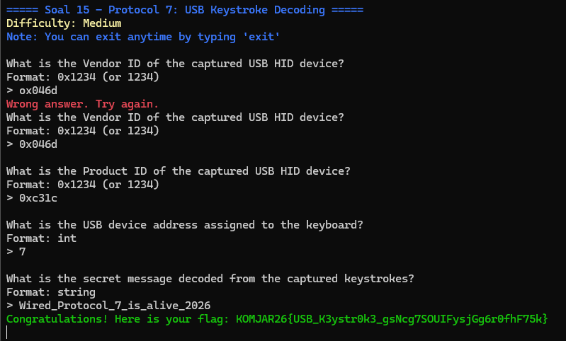

#### 16. Eiri meletakkan file malware di server. Dari file capture wired_ftp_theft.pcap, lakukan analisis lalu lintas FTP untuk mengidentifikasi alamat IP server FTP penyerang, banner software FTP yang digunakan, kredensial login penyerang, serta ukuran (size in bytes) dari file malware knights_payload.exe yang diunduh. Validasi temuan kalian pada socket server: ([link _file_](https://drive.google.com/drive/folders/1qBeAXVx1MG14L0jzGefqs3t8qO8VRMmb?usp=sharing)) **nc [IP_Group] 3403**

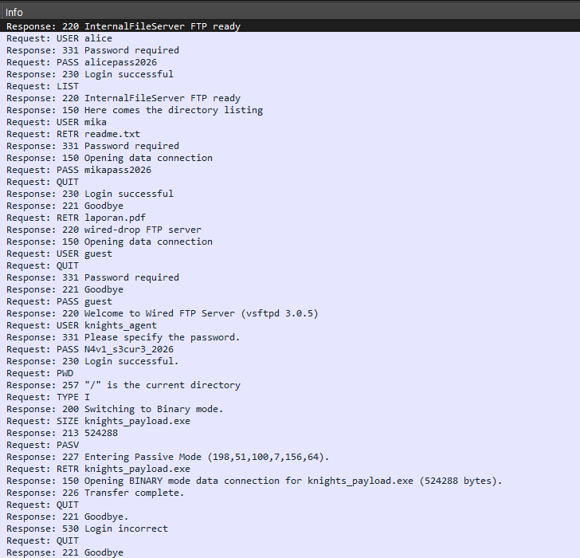

**objektif**

- Mengidentifikasi alamat IP server FTP penyerang
- Mencari tahu banner software FTP yang digunakan
- Mendapatkan kredensial login penyerang (Username dan Password)
- **Menentukan ukuran (size in bytes) dari file malware knights_payload.exe yang diunduh**

temuan

- Alamat IP server FTP penyerang: 198.51.100.7
- Banner software FTP yang digunakan: vsftpd 3.0.5
- **Kredensial login penyerang: Username knights_agent dengan Password N4v1_s3cur3_2026**
- Ukuran file malware knights_payload.exe: 524288 bytes

Verifikasi hasil temuan

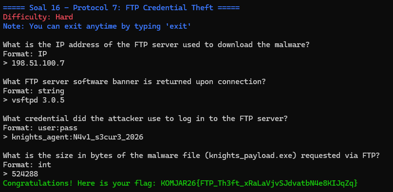

#### 17. Alice membuat halaman web di node-nya. Eiri memanfaatkan celah untuk mengunduh payload berbahaya ke sistem Alice. Analisis file capture wired_http_c2.pcap untuk mengidentifikasi nama domain (Host) tempat malware diunduh, alamat IP server penyerang, nama file executable malware yang diunduh, serta kode status HTTP yang dikembalikan. Validasi temuan kalian pada socket server: ([link _file_](https://drive.google.com/drive/folders/1iPYESj5AN-uXYXfD2Wo2cRrm_Rigr_D6?usp=sharing)) **nc [IP_Group] 3404**

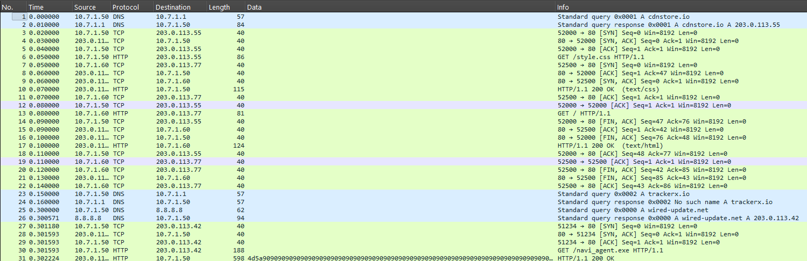

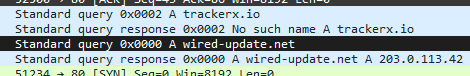

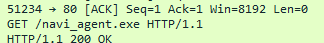

Objektif:

- Nama domain (Host): URL atau domain server tempat malware tersebut disimpan.
- Alamat IP server penyerang: Alamat IP dari domain/host tersebut.
- Nama file executable malware: Nama file program (biasanya berekstensi .exe) yang berhasil diunduh.
- Kode status HTTP: Kode balasan dari server penyerang saat proses unduh terjadi (misalnya 200 OK).

Temuan:

- Nama domain (Host) tempat malware diunduh: [wired-update.net](http://wired-update.net)
- Alamat IP server penyerang: 203.0.113.42
- Nama file executable malware: navi_agent.exe
- Kode status HTTP: 200

Verifikasi hasil temuan

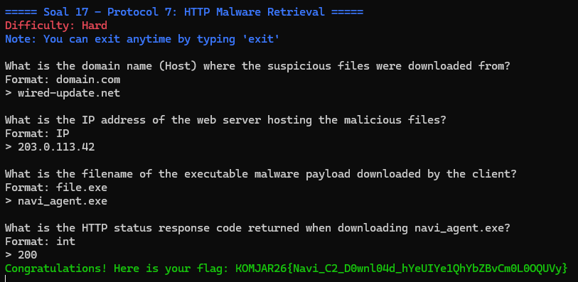

#### 18. Eiri mengubah taktik penyerangan dengan menanamkan file malware menggunakan protokol file sharing SMB. Analisis file capture wired_smb_transfer.pcapng untuk mengidentifikasi nama protokol jaringan yang dieksploitasi, IP pengirim dan penerima, folder tujuan penyimpanan malware pada sistem korban, serta nama file executable malware yang ditransfer. Validasi temuan kalian pada socket server:([link _file_](https://drive.google.com/file/d/1XBtKWtNM_RrSBTp2e3O5vBdiklcPNsKs/view?usp=sharing)) **nc [IP_Group] 3405**

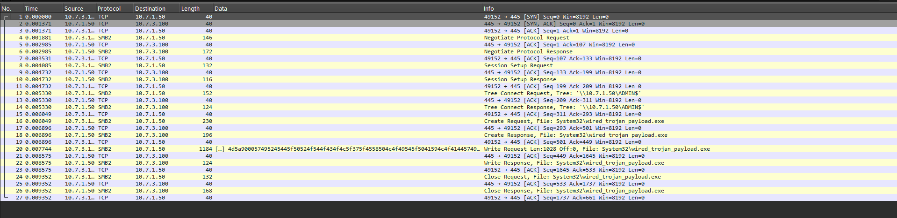

Objektif:

- Mengidentifikasi nama protokol jaringan yang dieksploitasi
- Mengidentifikasi alamat IP pengirim (penyerang)
- Mengidentifikasi alamat IP penerima (korban)
- Mengidentifikasi folder tujuan penyimpanan malware pada sistem korban
- Mengidentifikasi nama file _executable_ malware yang ditransfer

Temuan:

- Protokol jaringan: SMB2
- IP Pengirim: 10.7.3.100
- IP Penerima: 10.7.1.50
- Folder tujuan penyimpanan: System32
- Nama file malware: wired_trojan_payload.exe

Verifikasi hasil temuan:

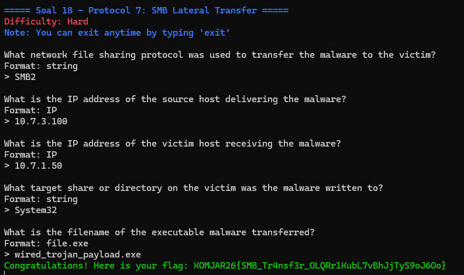

#### 19. Eiri meneror jaringan dengan mengirimkan email pemerasan melalui protokol SMTP tanpa enkripsi. Analisis file capture wired_smtp_threat.pcap pada stream TCP terkait, identifikasi alamat email korban yang ditargetkan, password korban yang diklaim bocor oleh penyerang, jenis malware yang diinfeksikan, batas waktu (dalam hari) yang diberikan, serta MailClientID yang tercantum pada pesan. Validasi temuan kalian pada socket server:([link _file_](https://drive.google.com/drive/folders/1RAW0cMoGDDStPyFHeJ_0t9kkoLGBsCmH?usp=sharing)) **nc [IP_Group] 3406**

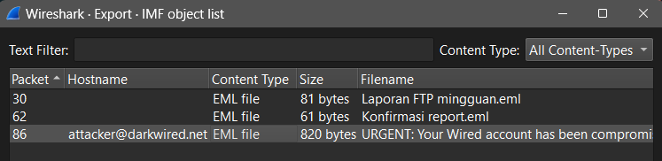

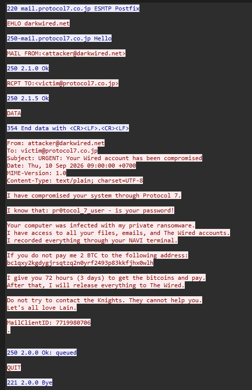

Objektif:

- Mengidentifikasi alamat email korban yang ditargetkan
- Mengidentifikasi password korban yang diklaim bocor oleh penyerang
- Mengidentifikasi jenis malware yang diinfeksikan
- Mengidentifikasi batas waktu (dalam hari) yang diberikan oleh penyerang
- Mengidentifikasi MailClientID yang tercantum pada pesan

Temuan:

- Alamat email korban: [victim@protocol7.co.jp](mailto:victim@protocol7.co.jp)
- Password korban yang bocor: pr0tocol_7_user
- Jenis malware: Ransomware
- Batas waktu: 72 hours (3 days)
- MailClientID: 7719980706

Verifikasi hasil temuan

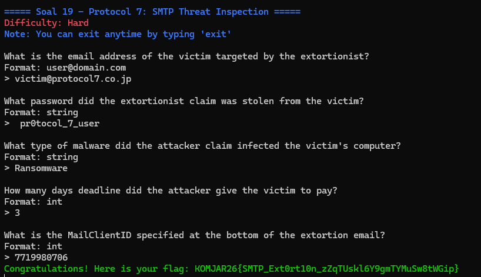

#### 20. Untuk rencana pamungkasnya, Eiri menyembunyikan komunikasi malware di balik saluran terenkripsi TLS. Namun Alice telah menyediakan file keylog untuk mendekripsi lalu lintas data tersebut. Analisis file capture wired_tls_decrypt.pcapng bersama keyslogfile.txt untuk mengidentifikasi versi protokol TLS yang dinegosiasikan, nama domain (SNI) yang diakses, alamat IP server HTTPS penyerang, User-Agent yang digunakan, serta HTTP request method dan path yang tersembunyi di dalam sesi dekripsi. Validasi temuan kalian pada socket server: ([link _file_](https://drive.google.com/file/d/1F7xN3ydIrA-pZaCb32MGseVeHKt-D_qZ/view?usp=sharing)) **nc [IP_Group] 3407**

Langkah langkah mengerjakan

1. Masukin keylogfile.txt buat dengan TSL
2. pencet edit di navbar
3. Pilih prefence > Protocl > TLS
4. Masukkan filenya ke kolom (pre)-Master_Secret log filename

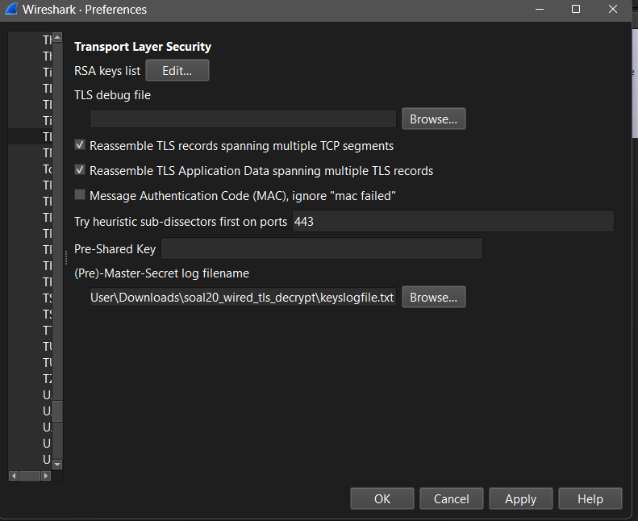

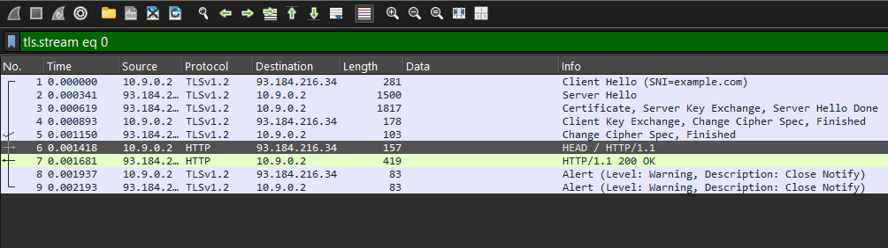

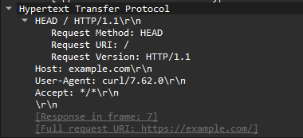

menemukan User agent di package no 6

Objektif:

- Mengidentifikasi versi protokol TLS yang dinegosiasikan
- Mengidentifikasi nama domain (SNI) yang diakses
- Mengidentifikasi alamat IP server HTTPS penyerang
- Mengidentifikasi User-Agent yang digunakan
- Mengidentifikasi HTTP request method
- Mengidentifikasi path yang diakses

Temuan:

- Versi protokol TLS: TLSv1.2
- Nama domain (SNI): [example.com](http://example.com)
- Alamat IP server HTTPS: 93.184.216.34
- HTTP request method: HEAD
- Path yang diakses: /
- User-Agent: curl/7.62.0

Verifikasi hasil temuan:

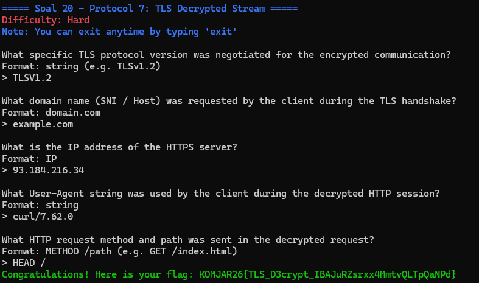
